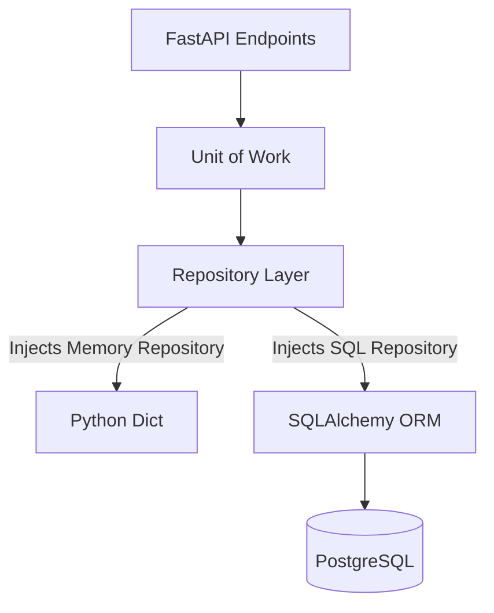

# claimOS Persistence Architecture

L'architecture est fondamentalement basée sur les principes du **Domain Driven Design (DDD)**.
Les endpoints n'interagissent jamais directement avec SQLAlchemy, mais toujours avec une interface abstraite de type `IRepository`.
Cela garantit une inversion de dépendance totale, et permet à claimOS de tourner indifféremment "In-Memory" ou "On-Disk" avec PostgreSQL.
