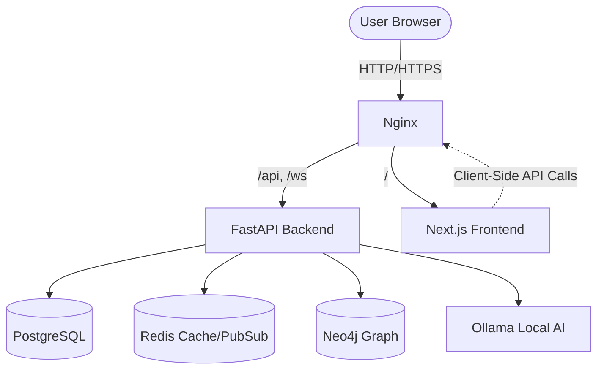

# claimOS Cloud-Native Architecture

```mermaid
graph TD
    Client([User Browser]) -->|HTTP/HTTPS| Nginx
    Nginx -->|/api, /ws| Backend[FastAPI Backend]
    Nginx -->|/| Frontend[Next.js Frontend]
    
    Backend --> Postgres[(PostgreSQL)]
    Backend --> Redis[(Redis Cache/PubSub)]
    Backend --> Neo4j[(Neo4j Graph)]
    Backend --> Ollama[Ollama Local AI]
    
    Frontend -.->|Client-Side API Calls| Nginx
```

This architecture ensures separation of concerns, scalability, and security by channeling all external traffic through the Nginx reverse proxy.
