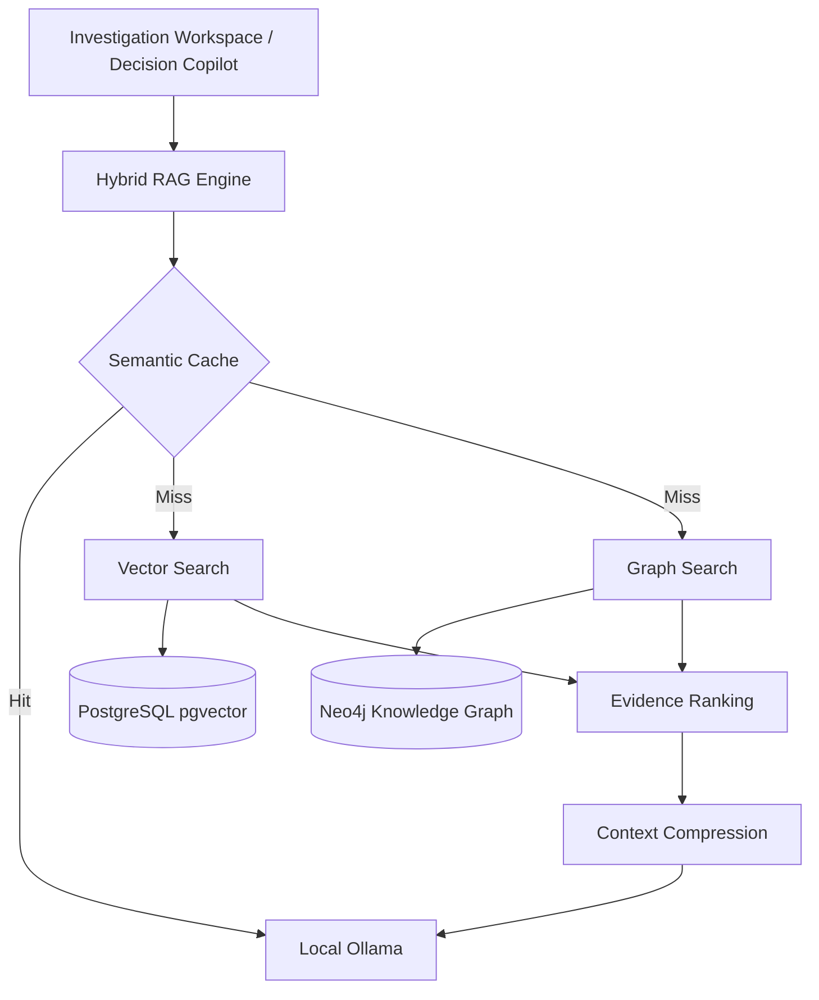

# Enterprise Knowledge Platform Architecture

## Composants
- **Vector Platform** : Gère les embeddings sémantiques.
- **Neo4j Graph** : Détecte les réseaux de fraude et les relations métier complexes (Entity Resolution).
- **Hybrid RAG** : Fusionne les deux sources de vérité avec un classement par pertinence (`Evidence Ranking`) et une compression du contexte (`Context Compression`) avant génération LLM.
