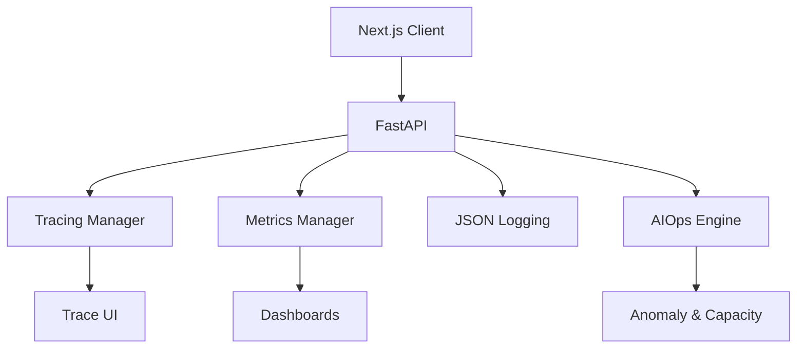

# Architecture d'Observabilité & Télémétrie

## Composants
- **Prometheus** : Expose `/api/v1/observability/metrics` pour un scraping externe.
- **OpenTelemetry** : Génère un `trace_id` unique qui est propagé dans tous les logs.
- **AIOps** : Une couche d'analyse prédictive qui évalue la santé des serveurs et remonte des anomalies (ex: Latence anormale ou VRAM surchargée).
