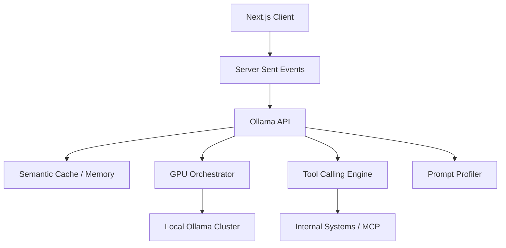

# Ollama Local Runtime Architecture

## Composants
- **OllamaClient** : Interface HTTP/2 asynchrone avec le cluster Ollama, gérant les Timeouts et le streaming.
- **GPU Orchestrator** : Abstraction garantissant qu'on ne dépasse jamais la VRAM disponible (éviction LRU automatique).
- **Tool Calling Engine** : Parser qui intercepte les requêtes de l'Ollama et les branche sur le graphe Neo4j, pgvector ou le moteur de règles.
