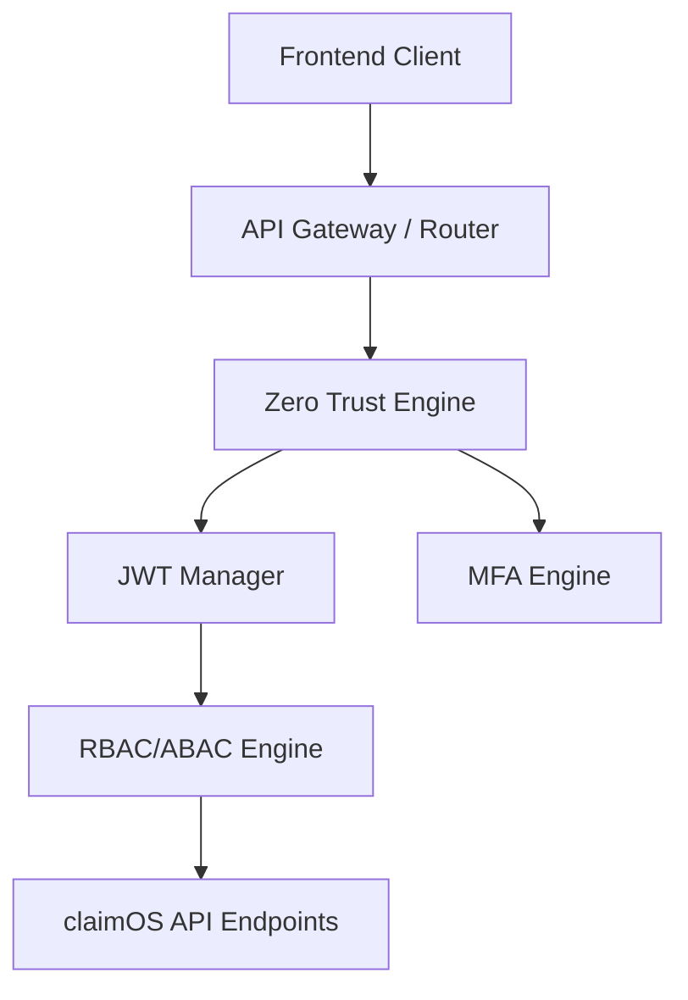

# Enterprise Security Architecture

## Composants Clés
- **JWT Manager** : Utilise RS256 (simulé en HS256 par défaut) pour générer des Access Tokens et Refresh Tokens avec révocation.
- **Password Policy** : Hachage via PBKDF2 (robuste et résilient), forçage de complexité, blocage anti brute-force.
- **Zero Trust** : Analyse la géolocalisation de l'IP et les nouveaux périphériques (`device_id`) pour exiger le MFA si le score de risque est trop élevé (>80).
- **Session Manager** : Permet la terminaison des sessions fantômes ou des anciens terminaux.
